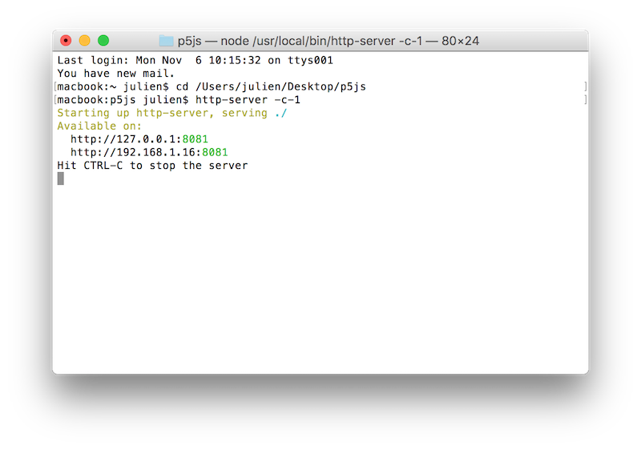
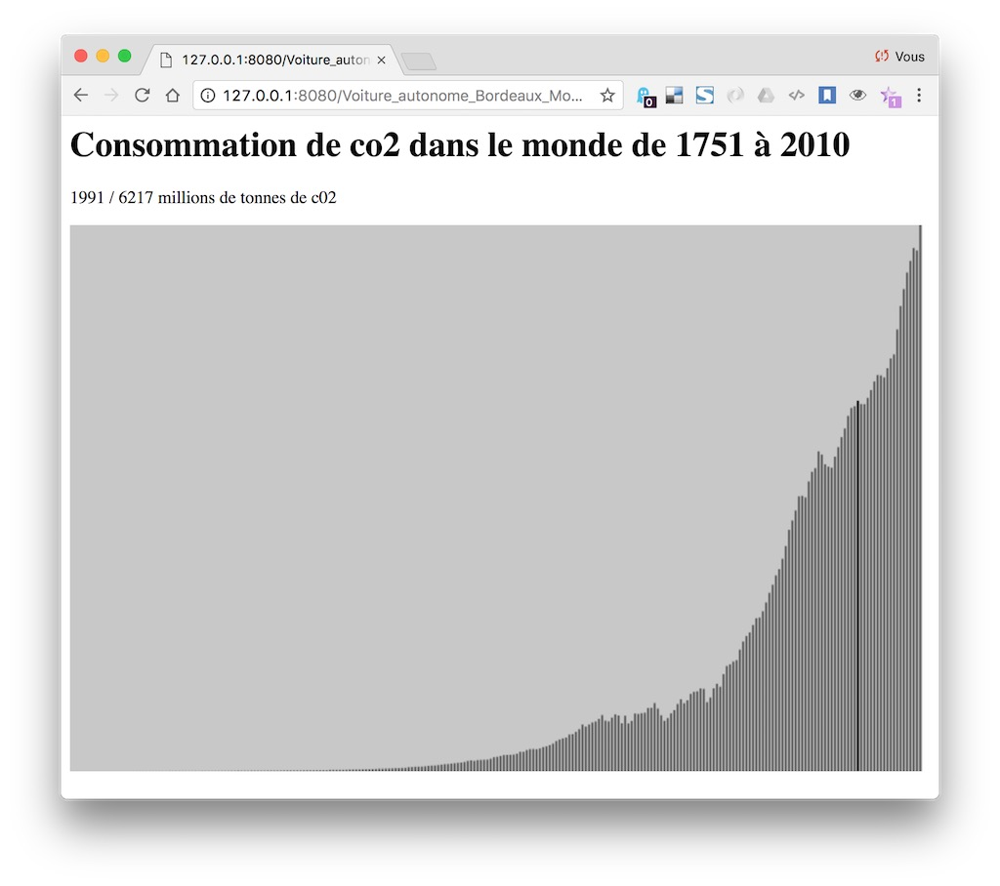

Voiture autonome
===============================================

### Méthodologie de travail
1. Ouvrir le terminal
 - :point_right: Mac /  cmd + barre espace et taper « terminal »
 - :point_right: PC /  windows puis rechercher et taper « cmd »

2. Se déplacer dans le dossier de travail avec la commande **cd** (change directory). Vous pouvez taper **cd** puis **glisser déposer le dossier** dans le terminal, son chemin entier va s'inscrire. 

3. Démarrer le serveur avec la commande 
```
http-server -c-1
```

4. Copier-coller une des deux adresses dans votre navigateur pour accéder à l'arborescence de vos dossiers de sketchs. Ne fermez pas la fenêtre du terminal, sinon le serveur s'arrêtera.
```
http://127.0.0.1:8080
```




## Cours #01 — lundi 16 octobre 2017 (M2) + vendredi 20 octobre (M1)

* notions de HTML + CSS + Javascript
  * structure d'une page web (head + body)
  * mise en forme avec les [styles CSS](https://www.w3schools.com/html/html_css.asp)
* Introduction à [p5js](https://p5js.org/) (« Processing pour le web »)
  * [anatomie d'un projet p5js](https://p5js.org/get-started/), différences avec un projet Processing ou Arduino.
  * révisions des bases de programmation vues avec [Processing](https://processing.org/)
     * gestionnaires [setup()](https://p5js.org/reference/#/p5/setup) et [draw()](https://p5js.org/reference/#/p5/draw)
     * variables / fonctions / boucles / conditions
  * notions de [DOM](https://fr.wikipedia.org/wiki/Document_Object_Model) pour manipuler les éléments du HTML.
  * présentation des outils de développements : 
    * inspection de la structure d'une page
    * console javascript
    * outils de développements pour mobile

# Liens
* [p5js](https://p5js.org/)
* Béranger Recoules - [Introduction à p5js](https://b2renger.github.io/Introduction_p5js/)
* Daniel Shiffman - [1.1: Introduction - p5.js Tutorial](https://www.youtube.com/watch?v=8j0UDiN7my4)
* Daniel Shiffman - [10.5: Working with APIs in Javascript - p5.js Tutorial](https://www.youtube.com/watch?v=ecT42O6I_WI)
* [OpenData Bordeaux Métropole](https://data.bordeaux-metropole.fr/)

## Cours #02 - vendredi 20 octobre
À rattraper

## Cours #03 - lundi 6 novembre
* Installation d'un serveur en local 
  * avec node http-server ( [instructions avec p5js, voir la deuxième option](https://github.com/processing/p5.js/wiki/Local-server) )
* Récupération de données : 
  * formats de données : texte, CSV, XML, JSON
  * chargement de données « statiques » : [fichier CSV de la quantité de co2 émis depuis 1751](https://datahub.io/core/co2-fossil-global)
    * chargement avec p5js
    * lecture des données, interaction canvas <-> dom via [p5.dom](https://p5js.org/reference/#/libraries/p5.dom)
    * dessin des données et interaction souris
    

