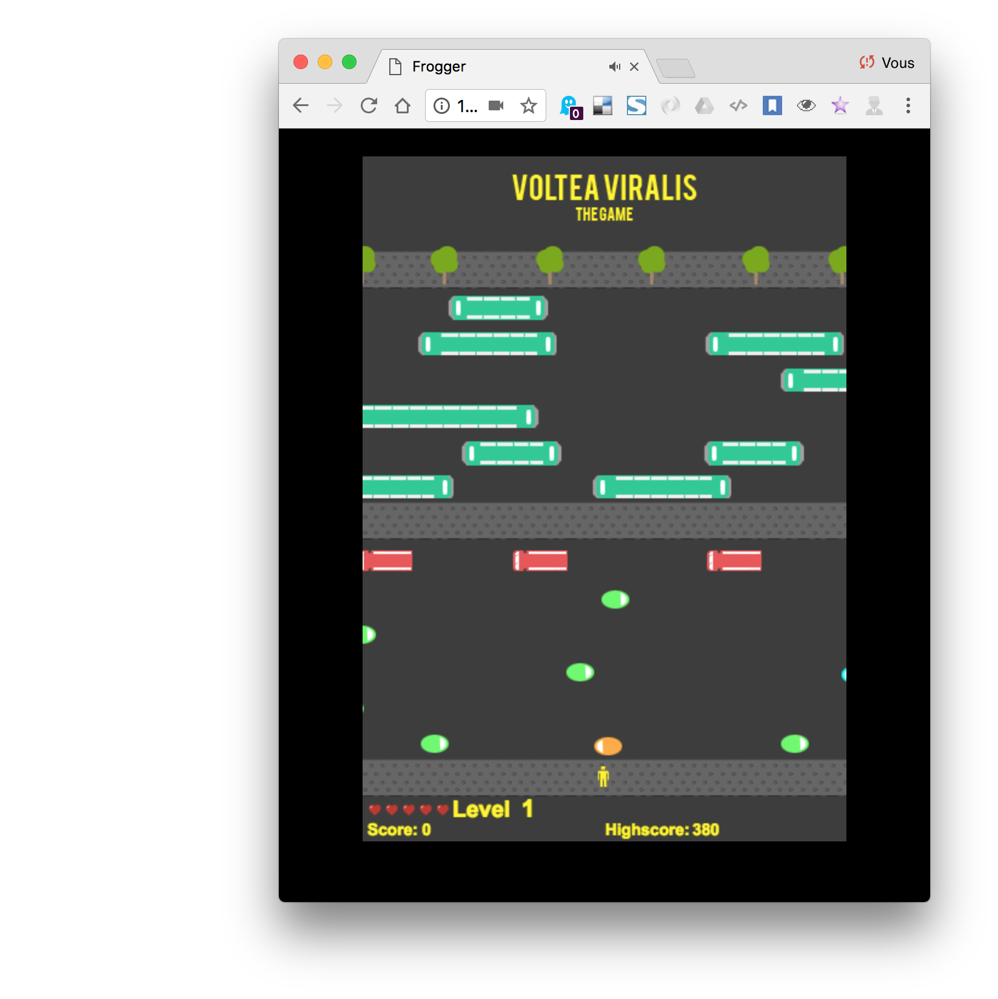

Voiture autonome
===============================================

### Méthodes de travail

(En référence à [la notice d'installation](https://github.com/processing/p5.js/wiki/Local-server) sur le wiki de p5.js)

1. Ouvrir le terminal
 - :point_right: Mac /  cmd + barre espace et taper « terminal »
 - :point_right: PC /  windows puis rechercher et taper « cmd »

2. Se déplacer dans le dossier de travail avec la commande **cd** (change directory). Vous pouvez taper **cd** puis **glisser déposer le dossier** dans le terminal, son chemin entier va s'inscrire. 

3. Démarrer le serveur avec la commande 
```
http-server -c-1
```

4. Copier-coller une des deux adresses dans votre navigateur pour accéder à l'arborescence de vos dossiers de sketchs. Ne fermez pas la fenêtre du terminal, sinon le serveur s'arrêtera.
```
http://127.0.0.1:8080
```


## Cours #01 — lundi 16 octobre 2017 (M2) + vendredi 20 octobre (M1)

* notions de HTML + CSS + Javascript
  * structure d'une page web (head + body)
  * mise en forme avec les [styles CSS](https://www.w3schools.com/html/html_css.asp)
* Introduction à [p5js](https://p5js.org/) (« Processing pour le web »)
  * [anatomie d'un projet p5js](https://p5js.org/get-started/), différences avec un projet Processing ou Arduino.
  * révisions des bases de programmation vues avec [Processing](https://processing.org/)
     * gestionnaires [setup()](https://p5js.org/reference/#/p5/setup) et [draw()](https://p5js.org/reference/#/p5/draw)
     * variables / fonctions / boucles / conditions
  * notions de [DOM](https://fr.wikipedia.org/wiki/Document_Object_Model) pour manipuler les éléments du HTML.
  * présentation des outils de développements : 
    * inspection de la structure d'une page
    * console javascript
    * outils de développements pour mobile

# Liens
* [p5js](https://p5js.org/)
* Béranger Recoules - [Introduction à p5js](https://b2renger.github.io/Introduction_p5js/)
* Daniel Shiffman - [1.1: Introduction - p5.js Tutorial](https://www.youtube.com/watch?v=8j0UDiN7my4)
* Daniel Shiffman - [10.5: Working with APIs in Javascript - p5.js Tutorial](https://www.youtube.com/watch?v=ecT42O6I_WI)
* [OpenData Bordeaux Métropole](https://data.bordeaux-metropole.fr/)

## Cours #02 - vendredi 20 octobre
À rattraper

## Cours #03 - lundi 6 novembre
* Installation d'un serveur en local 
  * avec node http-server ( [instructions avec p5js, voir la deuxième option](https://github.com/processing/p5.js/wiki/Local-server) )
* Récupération de données : 
  * formats de données : texte, CSV, XML, JSON
  * chargement de données « statiques » : [fichier CSV de la quantité de co2 émis depuis 1751](https://datahub.io/core/co2-fossil-global)
    * chargement avec p5js
    * lecture des données, interaction canvas <-> dom via [p5.dom](https://p5js.org/reference/#/libraries/p5.dom)
    * dessin des données et interaction souris
    


## Cours #04 - lundi 13 novembre
* Retour sur les notions abordées la semaine précédente : 
  * [boucles for](https://www.youtube.com/watch?v=cnRD9o6odjk), [conditions](https://www.youtube.com/watch?v=r2S7j54I68c), [variables](https://www.youtube.com/watch?v=Bn_B3T_Vbxs).
* Intégration de cartes avec des données dans une page 
  * exemples avec [Google Maps](https://developers.google.com/maps/?hl=fr) — [lien pour obtenir une clé API](https://developers.google.com/maps/documentation/javascript/get-api-key?hl=Fr)
  * exemples avec le système de [cartographie et de données de Bordeaux Métropole.](https://data.bordeaux-metropole.fr/apicub) — [lien pour obtenir une clé API](https://data.bordeaux-metropole.fr/key.php)
* Fun : commande vocale avec une carte 

# Liens
* [sketch p5.js en plein écran](http://gildasp.fr/exp/P5js-fullscreen/)
* [New York Times : Life after driving](https://www.nytimes.com/interactive/2017/11/08/magazine/tech-design-future-autonomous-car-20-percent-sex-death-liability.html) « road rage against the machine will boil over »

## Cours #05 - lundi 27 novembre
* Mise en ligne d'un sketch sur un serveur FTP
  * téléchargement de [FileZilla](https://filezilla-project.org/download.php?type=client) (client FTP)
    * configuration pour se connecter au ftp et déposer des fichiers (html/css/js) :point_right: voir la capture d'écran
    * connexion à l'adresse :point_right: [www.v3ga.net/~bplv_masterdis](http://www.v3ga.net/~bplv_masterdis/)
* Mise en page **responsive** pour mobile + desktop à traver les [CSS media queries](https://www.w3schools.com/css/css3_mediaqueries.asp).
  * voir aussi ce lien sur [alsa creations](https://www.alsacreations.com/article/lire/930-css3-media-queries.html)
  * adaptation du sketch *particules* à ce contexte, cela nécéssite de tenir compte du redimensionnement dynamique de l'élément canvas.
  


## Cours #06 - 5 décembre 
* Atelier autour du projet à remettre pour le **8 janvier 2018**. Un **scénario / note d'intention** seront à me remettre au plus tard **le 22 décembre**. 
 * **à produire** : une application mobile qui peut ou pourrait s'insérer dans votre scénario de fiction. Cette application doit incorporer un système de commande vocale pour effectuer une ou plusieurs actions au sein de cette application.    
 * **L'évaluation** se portera sur : 
   * *l'originalité* et la pertinence de la proposition.
   * *la création graphique* / mise en page. 
   * *la qualité technique* de l'application (ne pas se contenter de reprendre le template tel quel)

Le projet peut se faire par groupe, idéalement bien sur les groupes qui se sont constitués pour le projet design fiction mais ce n'est pas obligatoire. 

Je serai disponible pour discuter et vous accompagner techniquement sur ce projet (Skype / studio 2Roqs / université).
Il faudra juste **me prévenir à l'avance** pour que l'on convienne d'un rendez-vous. Je ne serai pas disponible du 23 décembre au 1er janvier.

Le template de projet est disponible dans le dossier [cours06](/cours06). 

## Projets

Les notes et mes remarques ici : https://github.com/v3ga/Voiture_autonome_Bordeaux_Montaigne_2017/blob/master/projets/Notes.pdf

### Humanergie
*Mégane Richard, Lucas Bramas, Alfian Sulaiman*<br>
[Présentation du projet](/projets/Humanergie.pdf)<br />
[Application en ligne](http://www.v3ga.net/cours/p5js/montaigne/2017/Humanergie/pages/page0.html)<br />


### Ellipsis
*Quentin Renaud, Marie Gaumer et Claire Ballester*<br>
[Présentation du projet](/projets/Ellipsis.pdf)<br />
[Application en ligne](http://www.v3ga.net/cours/p5js/montaigne/2017/Ellipsis/index.html)<br />
[Video](http://www.v3ga.net/cours/p5js/montaigne/2017/Ellipsis/Ellipsis.m4v)


### Siplay
*Margot Marraud des Grottes, Olivier Hordonneau, Noémie Antoine*<br>
[Présentation du projet](/projets/Siplay.pdf)<br />
[Application en ligne](http://www.v3ga.net/cours/p5js/montaigne/2017/SIPlay/labyrinthe/labyrinthe.html)<br />


### Linco
*Charline Deregnaucourt, Lucas De Pedro, Damien Blanchard*<br />
[Application en ligne](http://www.v3ga.net/cours/p5js/montaigne/2017/Linco/index.html)<br />
*(L'interface met du temps à charger à cause de la vidéo)*<br />


### Smile to me
*Bérengère Godefroy, Laura Vidoni, Sandrine Gonzales*<br>
[Présentation du projet](/projets/Smile_to_me.pdf)<br />
[Application en ligne](http://www.v3ga.net/cours/p5js/montaigne/2017/Smile_to_me/index.html)<br />


### Voltea viralis
*Laurine Farjanel, Damien Andrieu, Sylvain Colin*<br>
[Présentation du projet](/projets/Voltea_Viralis.pdf)<br />
[Application en ligne](http://www.v3ga.net/cours/p5js/montaigne/2017/Voltea_Viralis/index.html)<br />




## Lundi 29 janvier 2018
**« AI is the new electricity »** — [Andrew Ng](https://fr.wikipedia.org/wiki/Andrew_Ng)

Voir les notes de la conférence à Stereolux : https://github.com/v3ga/Conference_Stereolux_IA_creativite

### Définitions
* algorithme
  * [algorithme des colonies de fourmis](https://fr.wikipedia.org/wiki/Algorithme_de_colonies_de_fourmis)
* apprentissage (machine learning)
  * apprentissage profond (deep learning)
  * apprentissage supervisé et non supervisé

#### Quelques personnages clés
* [Charles Babbage](https://fr.wikipedia.org/wiki/Charles_Babbage) & [Ada Lovelace](https://fr.wikipedia.org/wiki/Ada_Lovelace)
* [Alan Turing](https://fr.wikipedia.org/wiki/Alan_Turing)
  * [Machine de Turing](http://morphett.info/turing/turing.html). 
    * exemple : 54 (101011) + 43 (101011) = 97 ([1100001](http://coolconversion.com/math/binary-octal-hexa-decimal/How-to-Convert_binary__110110_in_decimal_%3F))
    * [Le test de Turing](https://fr.wikipedia.org/wiki/Test_de_Turing) est une proposition de test d’intelligence artificielle fondée sur la faculté d'une machine à imiter la conversation humaine.
* Frank Rosenblatt
  * [Perceptron](https://fr.wikipedia.org/wiki/Perceptron)
* [Marvin Minsky](https://fr.wikipedia.org/wiki/Marvin_Minsky)
  * « L'intelligence artificielle est la science de faire faire à des machines des choses qui demanderaient de l'intelligence si elles étaient faites par des êtres humains »
  * [Perceptrons](https://mitpress.mit.edu/books/perceptrons)
* Yann LeCun
  * [The MNIST Database](http://yann.lecun.com/exdb/mnist/)
  * [Convolutional Network Demo from 1993](https://www.youtube.com/watch?v=FwFduRA_L6Q)
  * [Démonstration avec P5ML](https://itpnyu.github.io/p5-deeplearn-js/docs/neural-network-example.html)

### À visionner
* [Le deep learning — Science étonnante #27](https://www.youtube.com/watch?v=trWrEWfhTVg)
* [But what *is* a Neural Network? | Chapter 1, deep learning](https://www.youtube.com/watch?v=aircAruvnKk)

### Algorithmes / librairies
* [P5ML.js](https://itpnyu.github.io/p5-deeplearn-js/docs/getting-started.html)
  * LTSM : Long Short Term Memory networks
  * KNN : K-nearest neighbors
  * CNN : convolutionnal neural network
  * [YOLO : Real time object detection](https://fr.wikipedia.org/wiki/Perceptron)
    * [interface pour node.js](https://github.com/moovel/node-yolo) 
    * [interface pour openframeworks](https://github.com/mrzl/ofxDarknet)
* [deeplearn.js](https://deeplearnjs.org/)
* [Teachable machine](https://teachablemachine.withgoogle.com/) pour entrainer un réseau de neurone en ligne, qui fait partie [des expérimentations en ligne](https://experiments.withgoogle.com/ai) de Google sur l'IA.
* [Clarifai](https://clarifai.com/) pour la détection d'objets d'une image. 

### Hardware
* [AIY Vision Kit](https://blog.google/topics/machine-learning/introducing-aiy-vision-kit-make-devices-see/)

### Sujet pour le S2
À l'aide d'algorithmes de détection de contenu sur des images (ou des flux vidéos), vous imaginez et réalisez un service innovant intégrant cette technologie. Celui-ci pourra être indépendant du travail sur la fiction du S1. Le principe sera le suivant : 
*  Choix d'un flux d'images : caméras de surveillance, base de données d'images en ligne (Google images ou autres), flux vidéo d'une caméra, ... 
* Détection de caractéristiques sur ces images (objets, couleurs, NSFW, émotions sur un visage par exemple) utilisant un modèle particulier. À voir si les algorithmes que nous utilisons peuvent être entrainés avec nos propres donnés, ce qui serait bien ! 
* Traitement et interprétation de l'information recueillie, ne pas se contenter d'afficher simplement les informations de l'étape 2.  

* **à produire** : 
  * une application / installation intégrant un service de reconnaissance d'images. 
  * une vidéo courte (~1mn30) mettant en scène ce service. 
  * le tout pour le 9 avril. 

 * **L'évaluation** se portera sur : 
   * *l'originalité* et la pertinence de la proposition.
   * *la qualité technique* de l'application. 

Le projet peut se faire par groupe, idéalement bien sur les groupes qui se sont constitués pour le projet design fiction mais ce n'est pas obligatoire. 

Voici les applications / services que nous pourrons utiliser et que nous avons survolés hier : 
* [Clarifai](https://clarifai.com/) : je vous invite à créer un compte (gratuit) sur la plateforme et à bien étudier [les possibilités](https://www.clarifai.com/demo) qu'offrent [leurs modèles d'IA](https://www.clarifai.com/models).
* [Teachable machines](https://teachablemachine.withgoogle.com/) : testé hier avec un groupe, ça marche plutôt bien pour associer image <=> fonction. La bonne nouvelle est que nous pouvons « extraire » le principe de fonctionnement pour l'embarquer dans notre propre application (voir [ce lien](https://github.com/googlecreativelab/teachable-machine-boilerplate)), il existe même [un template avec p5.js](https://github.com/ITPNYU/p5-deeplearn-js/tree/master/demos/teachableMachine). Je me demande s'il est possible d'associer plus de trois « catégories » en entrée, à voir, ce serait dommage sinon ... 
* [ofxDarknet](https://github.com/mrzl/ofxDarknet) ou [node-yolo](https://github.com/moovel/node-yolo) ce sont les mêmes algorithmes qui permettent de détecter des objets et de placer une boite autour (*bounding box*). 
* [ofxLearn](http://genekogan.com/works/ofxLearn/) / general-purpose machine learning for Openframeworks.
* Détection sourire : 
  * [SmileCNN](https://github.com/kylemcdonald/SmileCNN) 
  * [Google Mobile Vision](https://developers.google.com/vision/face-detection-concepts) 
  * [Giant Emoji](https://github.com/googlecreativelab/giantemoji) qui intégre [ofxFaceTracker2](https://github.com/HalfdanJ/ofxFaceTracker2)
* Détection « pose » (squelettes) sur une photo / vidéo : 
    * [OpenPose](https://github.com/CMU-Perceptual-Computing-Lab/openpose)


## Mardi 6 février 2018
Voici quelques notes prises par rapport aux projets ébauchés avec quelques pistes technologiques pour les réaliser. Je vous demande pour la fin de la semaine prochaine (vendredi 16 février) de rédiger une note d'intention avec un scénario pour votre application ainsi que pour la vidéo. 

### Smile to me
* Projet lié au travail de scénographie avec Claire Azema. 
* Détection d'une personne et tracking avec un oeil (« logo ») à la manière de l'installation [Surface Tension](https://vimeo.com/43975363) de Rafaël Lozano-Hemmer.
  * utilisation d'une kinect pour tracker le mouvement d'une personne (application prête à l'emploi [KinectOSC](https://github.com/genekogan/KinectOSC)) et application Processing / p5.js pour faire le rendu de l'œil.

### Inu
* Projet de site web « goodies » lié à l'univers Inu.
* Utilisation de la technique de « style transfer » pour générer des images à télécharger (fonds d'écran pour pc / mobiles)
  * Voir ce lien : https://itpnyu.github.io/ml5/docs/transform-net-example.html , ce script pourrait être intégré à votre site plutôt que de passer par un service externe.

### « Capitaine de soirée »
* Installation qui permet d'évaluer si une personne est apte à conduire à fonction des traits de son visage.
* Fabrication / entrainement d'un modèle :
  * Voir ce lien : http://ml4a.github.io/guides/ConvnetOSC/
  * [Train your facial expressions using machine learning - FaceOSC, Processing & Wekinator](https://vimeo.com/175947130)

### Ellipsis
* Détection de visages avec déclenchement d'une interface pour afficher des informations en fonction de la personne reconnue. 
* Entrainement d'un modèle pour détecter plusieurs visages. 
* Voir [Programme administratif personnalisé d’accueil (PAPA)](http://strabic.fr/Le-design-graphique-pour-les-machines)

### « Panneau publicitaire adaptatif »
* Des panneaux qui modulent l'apparence d'un message publicitaire en fonction des caractéristiques d'une personne (age, sexe, etc...)
* Utilisation du modèle [« Demographics » de Clarifai](https://www.clarifai.com/models/demographics-image-recognition-model/c0c0ac362b03416da06ab3fa36fb58e3)


